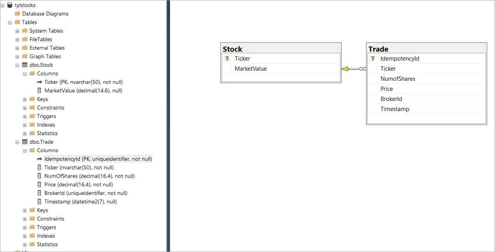

# Introduction 
TODO: This project is a solution to the London Stock API technical test.
It aims to provide a basic api project to fulfill the test requirements.
The Technical Solution Notes section at the end has answers to the questions asked in the test. 

# Getting Started
* The project is written using VS 2022 and .Net 6.
* The project has a Swagger UI at:  https://localhost:7283/swagger.
* A test database has been implmented in memory, use the following ticker values for your manual api tests:
    * SMB
    * XRS
    * ABC
* A Postman collection to run the tests is also provided in the Postman folder.

## Prerequisites
* Unfortunately you will need VS 2022 to run this project as .Net 6 projects are only supported in VS 2022.

---

# Technical Test
## London Stock API
We are the London Stock Exchange and we are creating an API to receive notification of trades from authorised brokers and expose the updated price to them.

* We need to receive every exchange of shares happening in real-time, and we need to know:
    * What stock has been exchanged (using the ticker symbol)
    * At what price (in pound)
    * Number of shares (can be a decimal number)
    * ID of broker managing the trade

* A relational database is used to store all transactions happening. Consider a minimal schema and data structure. 

* We need to expose the current value of a stock, values for all the stocks on the market and values for a range of them (as a list of ticker symbols).

* Assume you can use SDKs and middlewares for common functionalities.

* You task is to define a simple version of the API, including a definition of data model. Describe shortly the system design for an MVP.
## Enhancements
* Is this system scalable? How can it cope with high traffic? Can you identify bottlenecks and suggest an improved design and architecture? Feel free to suggest a complete different approach, but be sure you can obtain the same goal. 
## Submission
* If you can share a GitHub repos, that’s our preferred method. But if you prefer to send over a zip file of the solution or write in a text document, it’s fine, but be sure it’s clear and understandable.
## Evaluation
* This assignment should not take more than 2 hours. We are looking for well structure code and problem solving focus. The solution does not have to be production ready, but consideration of NFRs is important. 
* The problem definition is quite open, we want to see your ability with wide systems.
* About enhancements, we do not expect a complete system design, more a high level description. Prepare your ideas for the upcoming interview!   

---

# Technical Solution Notes
* I've written a basic web api solution which is fleshed out a bit to show how I would organise the code in the project going forward.
* I've added a few unit tests to demonstrate how I would use Moq to go about testing services. Of course more tests would need to added to cover all the services and methods.

## Db Schema

## Enhancement Notes
Is this system scalable? How can it cope with high traffic? Can you identify bottlenecks and suggest an improved design and architecture? Feel free to suggest a complete different approach, but be sure you can obtain the same goal. 

* In order to meet the scalability, reliability and resiliency challenges, I would change the architecture and base it around message queues.

* The system needs to be able to cope with system failures and downtime and high traffic scenarios where the data could change many times a second
and ensuring the transactions are processed correctly if they are submitted near the same time.

* The database writes are also a potential bottleneck and will be the slowest part of the system if we need to wait for completion.
We do not want to lose any trades and it may be essential that they performed in the right order if the market value changes based on the trades.
Putting each trade onto a queue with timestamp and idempotencyId will:
    * Improve the performance of the api as it is now just writing the trade onto a queue without needing to consider or wait for responses from downstream processes.
    * The api itself can be scaled up to many instances to cope with high numbers of requests (Azure/AWS provide autoscaling facilitys based on various metrics includeding request traffic).
    * Azure/AWS provide several robust queueing systems (e.g. Azure Service Bus, Azure Event Hub) to ensure messages are not lost.
    * With Queues you can configure then to allow trades to be replayed/reprocessed messages in the event of system failure.
    * An IdempotencyId can be used to ensure a message is processed only once even if it is retransmitted.
    * Cloud message Queueing systems can be architected to ensure messages are processed in the correct order. 
    * Cloud message can also be scaled to many instances or tiers depending on processing requirements. 

